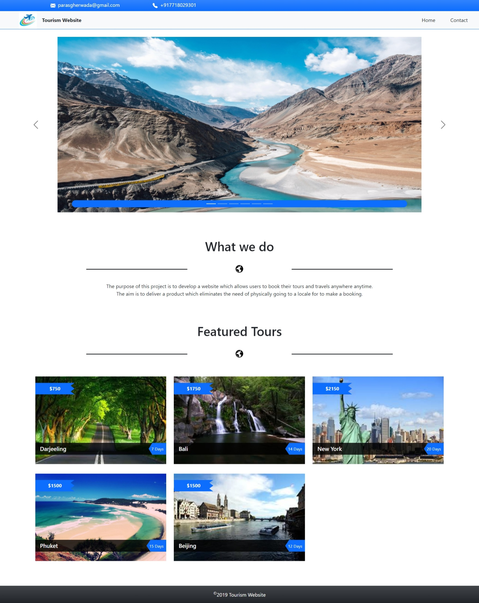
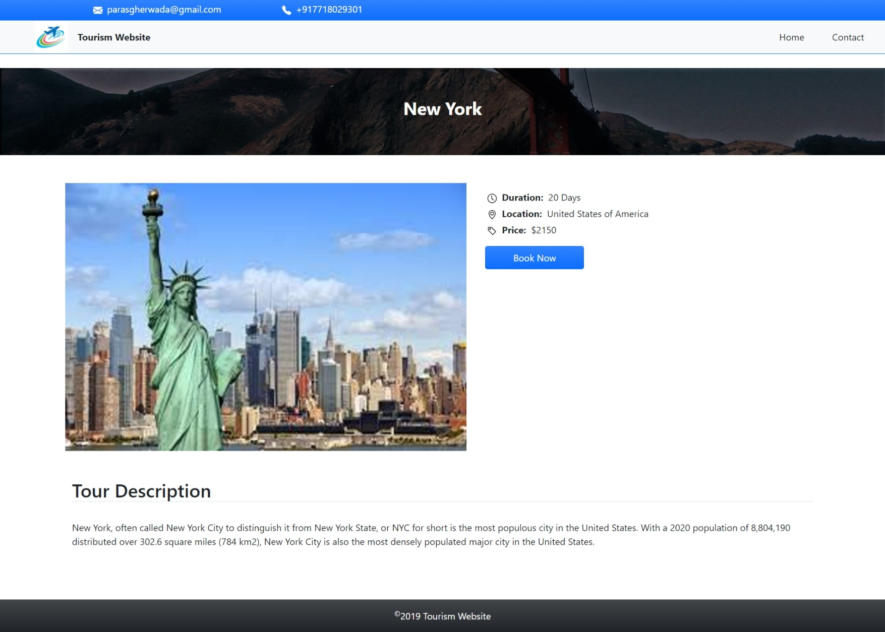
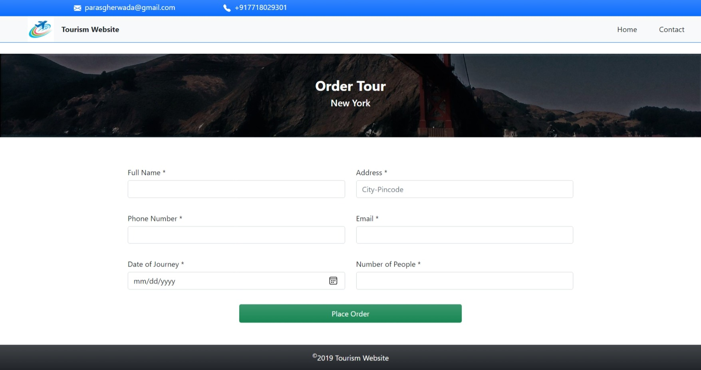
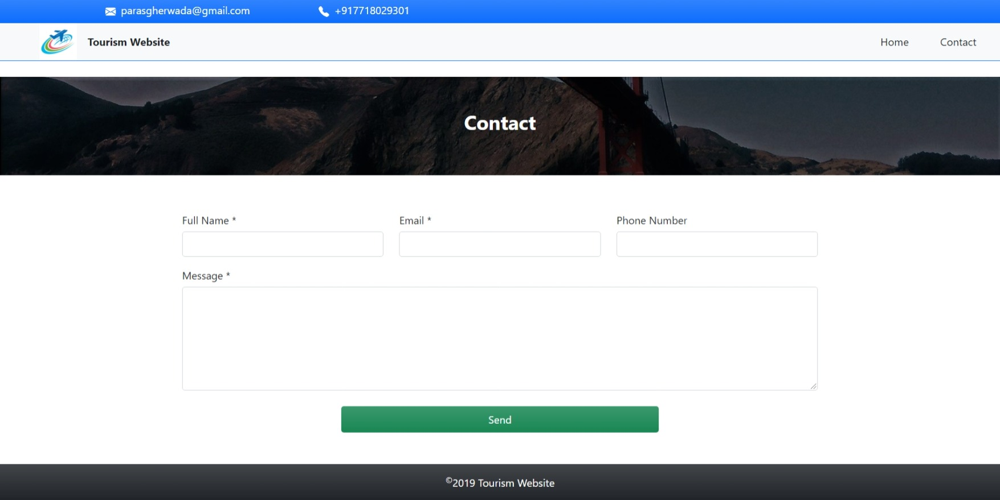
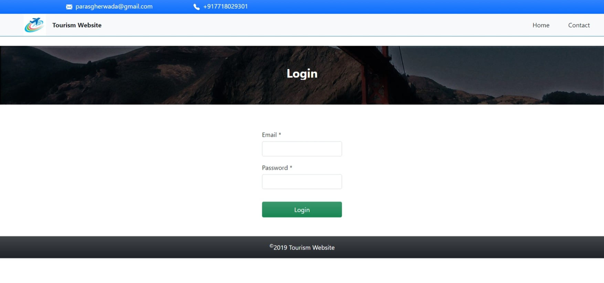
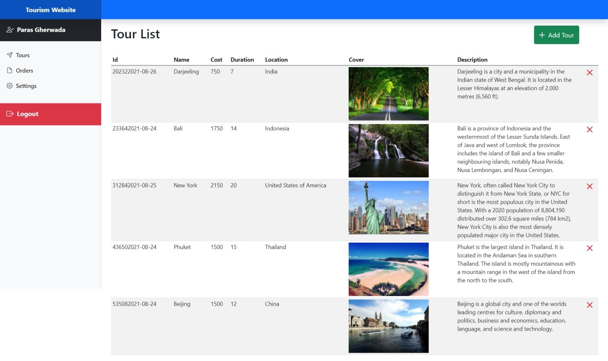
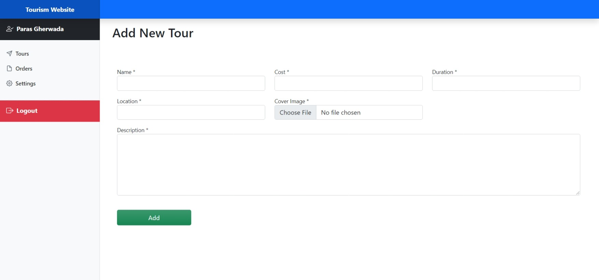
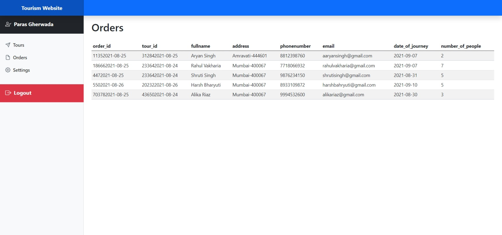
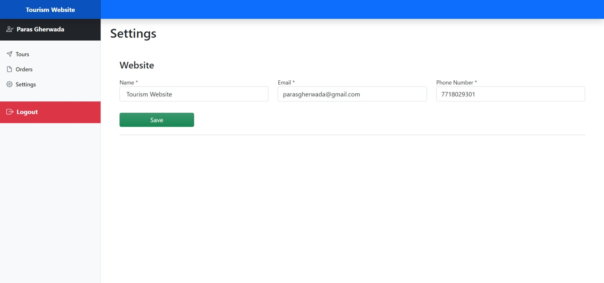

# About

Developed as a mid-term project using XAMPP stack, "Tourism" is an implementation of a tour booking website which helps customers to book tours across the globe. It primarily emphasizes on CRUD operations.

Technologies used : HTML, CSS, PHP, Bootstrap and XAMPP (Apache & MySql).

1. User Actions
      * Book Tour
      * Contact (Not Supported)

2. Admin Action
      * View Tours
      * Add New Tour
      * Delete Tour
      * View Orders
      * Manage Site Info

# Details and Screenshots
   * User Actions
     1. Home Page
      
        The homepage has a list of tours that the user can view and order, along with the cost per head and duration of each tour. The homepage also shows contact details of website admin using which the user can communicate and clear their doubts(if any). Other notable sections include a nav bar (carrying icon and name of the website and a link to contact page), a carousel (that slides the images of a few breathtaking scenerios), and objective of the project.

        

     2. Select Tour

        This page along with the tour image, name, location and price, also provides some extra details about the selected tour.

        

     3. Order Tour
      
        Here the user can provide the required details about themselves and place an order for the tour.

        

     4. Contact Page (Only UI. Backend not supported)

        On this page the user can ask any query or doubts that they have.

        PS : Doesnt work because xampp encounted some error and crashes when modified php.ini and sendmail.ini for enabling mailing feature, hence not implemented backend.

        
  
   * Admin Actions
     1. Login Page
        
        Self explanatory 😄.

        PS : Replace the current page name with 'login.php' in address bar URL to redirect here.

        

     2. View Tours

        An alternately striped table showing the details of active tours along with "Add Tour" and "Delete Tour" feature. Changes made will be relected to the tour list in homepage.

        

     3. Add New Tour

        An extension to the "Tour List" page as mentioned, this page allow the admin to add a new tour with its details. The newly added tour is then visible to user in homepage.

        

     4. Orders Page

        This page shows the bookings done users for each tour along with the order id, tour id, date of journey along with other details of the user as requested on the orders page.

        

     5. Website Settings Page

        Over here the admin can update their communication details and / or website name. Any changes made will be relected back on the homepage and other associated pages.

        

#  Learning Objective

* Session Management
* CRUD Operations
* Message Passing

# Helpful Links

* [HTML](https://en.wikipedia.org/wiki/HTML)
* [CSS](https://en.wikipedia.org/wiki/CSS)
* [Bootstrap](https://getbootstrap.com/docs/5.1/getting-started/introduction/)
* [PHP](https://www.w3schools.com/php/)
* [MySql](https://www.w3schools.com/mysql/default.asp)
* [CRUD](https://docs.microsoft.com/en-us/iis-administration/api/crud)
